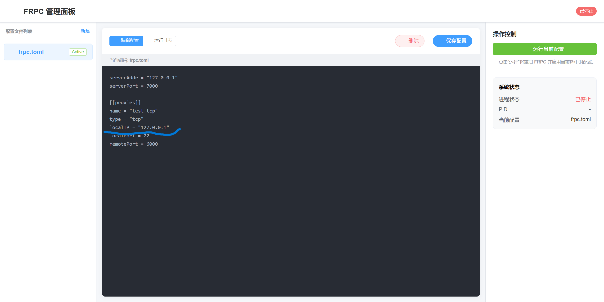

# FRP Client Manager (Docker)

这是一个基于 Docker 的 FRP 客户端 (frpc) 部署方案，内置了 Web 管理面板，方便用户在线修改配置文件并重启服务。

## 功能特性

- **开箱即用**：基于 Docker 部署，环境隔离，安装简单。
- **Web 管理**：提供直观的 Web 界面 (端口 8000)，可直接编辑 `frpc.toml` 配置文件。
- **自动重启**：修改配置后可自动或手动重启 frpc 进程。
- **多架构支持**：Dockerfile 自动检测架构 (amd64/arm64) 下载对应的 frp 二进制文件。

## 快速开始

### 1. 下载项目

```bash
git clone https://github.com/Are-You-Really-Happpy/FRP_Client_Manager_Docker
cd FRP_Client_Manager_Docker
```

### 2. 构建镜像

```bash
docker build -t my-frp-app .
```

### 3. 运行容器

运行容器时，请确保将容器加入到需要转发服务的 Docker 网络中，并暴露 8000 端口用于管理面板。

```bash
# 假设你的其他服务所在的网络名称为 "1panel-network" (请根据实际情况修改)
docker run -d \
  --name frpc-manager \
  --network 1panel-network \
  -p 8000:8000 \
  my-frp-app
```

> **注意**：如果还没有网络，可以先创建一个：`docker network create my-network`，然后将其他容器也加入该网络。

## 使用说明

1.  **访问管理面板**：
    打开浏览器访问 `http://localhost:8000`。

2.  **修改配置**：
    在 Web 界面中编辑 `frpc.toml`。

3.  **配置示例**：
    由于 frpc 容器与其他服务在同一个 Docker 网络下，你可以直接使用**容器名称**作为 `localIP`。

    假设你有一个名为 `1Panel-openlist-ci0d` 的容器，开放了 8080 端口，你想通过 frp 转发。

    `frpc.toml` 配置如下：

    ```toml
    serverAddr = "x.x.x.x"
    serverPort = 7000

    [[proxies]]
    name = "web-service"
    type = "tcp"
    localIP = "1Panel-openlist-ci0d"  # 直接填写目标容器的名称
    localPort = 8080
    remotePort = 6001
    ```

4.  **保存并生效**：
    点击保存按钮，服务会自动重启应用新的配置。

## 安全认证

为了保护 Web 管理面板，系统会在启动时自动生成一个随机密码。

1.  **查看密码**：
    运行容器后，通过查看容器日志获取登录密码：
    ```bash
    docker logs frpc-manager
    ```
    你会看到类似如下的输出：
    ```
    ==================================================
    Admin Authentication Credentials:
    Username: admin
    Password: <随机生成的密码>
    ==================================================
    ```

2.  **自定义密码**（可选）：
    如果你想指定密码，可以在运行容器时添加环境变量 `ADMIN_PASSWORD`：
    ```bash
    docker run -d \
      --name frpc-manager \
      --network 1panel-network \
      -p 8000:8000 \
      -e ADMIN_PASSWORD="your_secure_password" \
      my-frp-app
    ```

3.  **忘记密码**：
    如果忘记了密码，可以进入容器查看保存的密码文件：
    ```bash
    docker exec -it frpc-manager cat /app/admin_password.txt
    ```

## 注意事项

- **Docker 网络**：要被转发的容器必须和本 frpc 容器在同一个 Docker 网络下，否则无法通过容器名称解析 IP。
- **端口冲突**：请确保宿主机的 8000 端口未被占用。

---
效果图：

